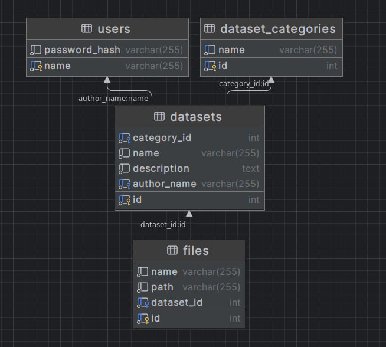

# Реалізація інформаційного та програмного забезпечення

## SQL-скрипт для створення на початкового наповнення бази даних

```sql
CREATE TABLE `users` (
	`name` varchar(255) NOT NULL UNIQUE,
	`password_hash` varchar(255) NOT NULL,
	PRIMARY KEY (`name`)
);

CREATE TABLE `dataset_categories` (
	`id` INT NOT NULL AUTO_INCREMENT,
	`name` varchar(255) NOT NULL UNIQUE,
	PRIMARY KEY (`id`)
);

CREATE TABLE `datasets` (
	`id` INT NOT NULL AUTO_INCREMENT,
	`category_id` INT NOT NULL,
	`name` varchar(255) NOT NULL,
	`description` TEXT NOT NULL,
	`author_name` varchar(255) NOT NULL,
	PRIMARY KEY (`id`)
);

CREATE TABLE `files` (
	`id` INT NOT NULL AUTO_INCREMENT,
	`name` varchar(255) NOT NULL,
	`path` varchar(255) NOT NULL,
	`dataset_id` INT NOT NULL,
	PRIMARY KEY (`id`)
);

ALTER TABLE `datasets` ADD CONSTRAINT `datasets_fk0` FOREIGN KEY (`category_id`) REFERENCES `dataset_categories`(`id`);

ALTER TABLE `datasets` ADD CONSTRAINT `datasets_fk1` FOREIGN KEY (`author_name`) REFERENCES `users`(`name`);

ALTER TABLE `files` ADD CONSTRAINT `files_fk0` FOREIGN KEY (`dataset_id`) REFERENCES `datasets`(`id`);
```

### Діаграма класів


## RESTfull сервіс для управління даними(Python, Sanic)
RESTfull сервіс створено на мові програмування Pyhon, використовуючи Sanic RESTful
#### Середовище
Database
```python
import aiomysql

# Database configuration
DB_CONFIG = {
    'host': 'localhost',
    'port': 3306,
    'user': 'olha',
    'password': 'olha_pass',
    'db': 'MyDB',
}

# Create a MySQL connection pool
async def create_db_connection_pool():
    return await aiomysql.create_pool(**DB_CONFIG)
```

App
```python
import aiomysql
from sanic import Sanic
from sanic_restful_api import Api

from restful_backend.db import create_db_connection_pool


app = Sanic("restful_backend")
api = Api(app)

# app.ctx.db_pool = asyncio.run(create_db_connection_pool())

async def execute_sql(query, args=None, fetch=False):
    pool = await create_db_connection_pool()
    async with pool.acquire() as conn:
        async with conn.cursor(aiomysql.DictCursor) as cur:
            await cur.execute(query, args)
            if fetch:
                return await cur.fetchall()
            await conn.commit()

    pool.close()
    await pool.wait_closed()
```

Server 
```python
from restful_backend.app import api, app
from restful_backend.resources.dataset_categories import DatasetCategoriesResource
from restful_backend.resources.datasets import DatasetsResource
from restful_backend.resources.files import FilesResource
from restful_backend.resources.users import UsersResource


# Add routes to the API
api.add_resource(UsersResource, '/users', name="users")
api.add_resource(UsersResource, '/users/<name>', name="users_detail")
api.add_resource(DatasetCategoriesResource, '/dataset_categories', name="dataset_categories")
api.add_resource(DatasetCategoriesResource, '/dataset_categories/<category_id>',  name="dataset_categories_detail")
api.add_resource(DatasetsResource, '/datasets', name="datasets")
api.add_resource(DatasetsResource, '/datasets/<dataset_id>', name="datasets_detail")
api.add_resource(FilesResource, '/files', name="files")
api.add_resource(FilesResource, '/files/<file_id>', name="files_detail")

# Other routes would be added in a similar manner for DatasetCategoriesResource, DatasetsResource, and FilesResource.

if __name__ == '__main__':
    app.run(debug=True)
```
User
```python
# Users Resource
import hashlib

from sanic_restful_api import Resource

from restful_backend.app import execute_sql


class UsersResource(Resource):
    async def get(self, request, name=None):
        if name is None:
            users = await execute_sql("SELECT * FROM users", fetch=True)
        else:
            users = await execute_sql("SELECT * FROM users WHERE name = %s", (name,), True)
        return {'users': users}

    @staticmethod
    def get_password_hash(password: str) -> str:
        return hashlib.sha1(password.encode("utf-8")).hexdigest()

    async def post(self, request, name):
        data = request.json
        password_hash = self.get_password_hash(data['password'])
        await execute_sql("INSERT INTO users (name, password_hash) VALUES (%s, %s)", (name, password_hash))
        return {'message': 'User created'}, 201
```

Files
```python
# Files Resource
from sanic_restful_api import Resource

from restful_backend.app import execute_sql


class FilesResource(Resource):
    async def get(self, request, file_id=None):
        if file_id:
            query = "SELECT * FROM files WHERE id = %s"
            args = (file_id,)
        else:
            query = "SELECT * FROM files"
            args = None
        files = await execute_sql(query, args, fetch=True)
        return {'files': files}

    async def post(self, request):
        data = request.json
        dataset_id = data['dataset_id']
        name = data['name']
        path = data['path']
        await execute_sql("""
                 INSERT INTO files (dataset_id, name, path)
                 VALUES (%s, %s, %s)
             """, (dataset_id, name, path))
        return {'message': 'File created'}, 201

    async def put(self, request, file_id):
        data = request.json
        dataset_id = data.get('dataset_id')
        name = data.get('name')
        path = data.get('path')
        await execute_sql("""
                 UPDATE files
                 SET dataset_id = %s, name = %s, path = %s
                 WHERE id = %s
             """, (dataset_id, name, path, file_id))
        return {'message': 'File updated'}

    async def delete(self, request, file_id):
        await execute_sql("DELETE FROM files WHERE id = %s", (file_id,))
        return {'message': 'File deleted'}
```

Datasets
```python
# Datasets Resource
import logging

from sanic_restful_api import Resource

from restful_backend.app import execute_sql


class DatasetsResource(Resource):
    @staticmethod
    async def get_files_for_dataset(dataset: dict) -> list:
        files_query = "SELECT * FROM files WHERE dataset_id = %s"
        args = (dataset["id"],)
        related_files = await execute_sql(files_query, args, fetch=True)
        logging.info(related_files)
        return related_files

    async def get(self, request, dataset_id=None):
        if dataset_id:
            query = "SELECT * FROM datasets WHERE id = %s"

        else:
            query = "SELECT * FROM datasets"
            args = None

        datasets = await execute_sql(query, args, fetch=True)
        for dataset in datasets:
            dataset["files"] = await self.get_files_for_dataset(dataset)

        return {'datasets': datasets}

    async def post(self, request):
        data = request.json
        category_id = data['category_id']
        name = data['name']
        description = data['description']
        author_name = data['author_name']
        await execute_sql("""
            INSERT INTO datasets (category_id, name, description, author_name)
            VALUES (%s, %s, %s, %s)
        """, (category_id, name, description, author_name))
        return {'message': 'Dataset created'}, 201

    async def put(self, request, dataset_id):
        data = request.json
        category_id = data.get('category_id')
        name = data.get('name')
        description = data.get('description')
        author_name = data.get('author_name')
        await execute_sql("""
            UPDATE datasets
            SET category_id = %s, name = %s, description = %s, author_name = %s
            WHERE id = %s
        """, (category_id, name, description, author_name, dataset_id))
        return {'message': 'Dataset updated'}

    async def delete(self, request, dataset_id):
        await execute_sql("DELETE FROM datasets WHERE id = %s", (dataset_id,))
        return {'message': 'Dataset deleted'}
```

Dataset Categories
```python
# DatasetCategories Resource
from sanic_restful_api import Resource

from restful_backend.app import execute_sql


class DatasetCategoriesResource(Resource):
    async def get(self, request, category_id=None):
        if category_id:
            query = "SELECT * FROM dataset_categories WHERE id = %s"
            args = (category_id,)
        else:
            query = "SELECT * FROM dataset_categories"
            args = None

        categories = await execute_sql(query, args, fetch=True)
        return {'categories': categories}

    async def post(self, request):
        data = request.json
        category_name = data['name']
        await execute_sql("INSERT INTO dataset_categories (name) VALUES (%s)", (category_name,))
        return {'message': 'Category created'}, 201

    async def put(self, request, category_id):
        data = request.json
        category_name = data['name']
        await execute_sql("UPDATE dataset_categories SET name = %s WHERE id = %s", (category_name, category_id))
        return {'message': 'Category updated'}

    async def delete(self, request, category_id):
        await execute_sql("DELETE FROM dataset_categories WHERE id = %s", (category_id,))
        return {'message': 'Category deleted'}
```
