# Тестування працездатності системи (Swagger)

У цьому розділі продемонстроване тестування системи і взаємодія з такими моделями як Users, Dataset Categories, Dataset, File

## Users

### Get (All)

    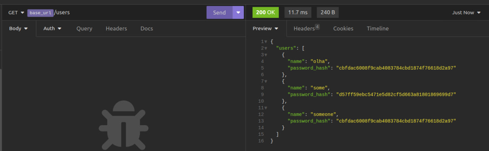

### Get (Single User)

    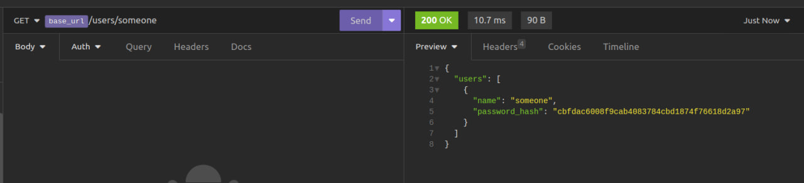

### Add User

    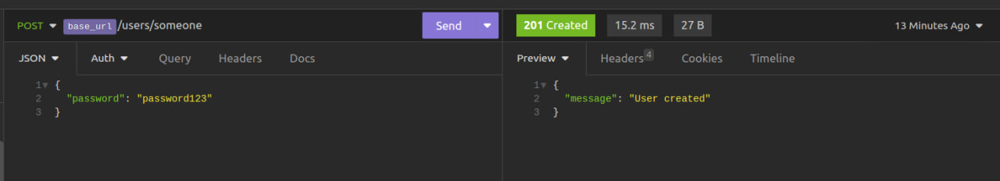

## Dataset Categories

### Get (All)

    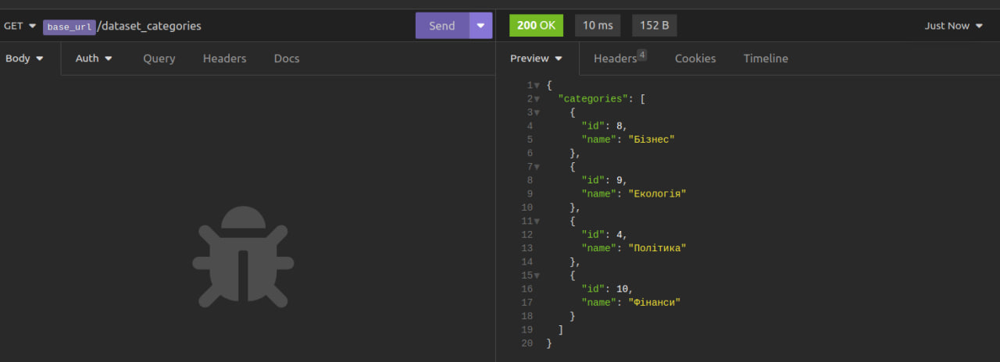

### Get (Single Dataset Category)

    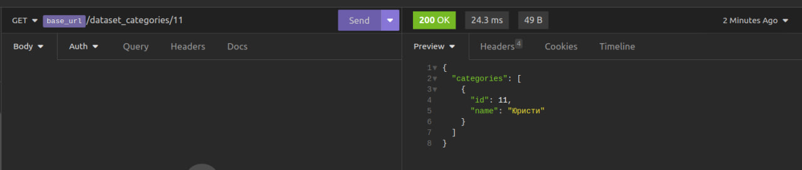

### Create Dataset Category

    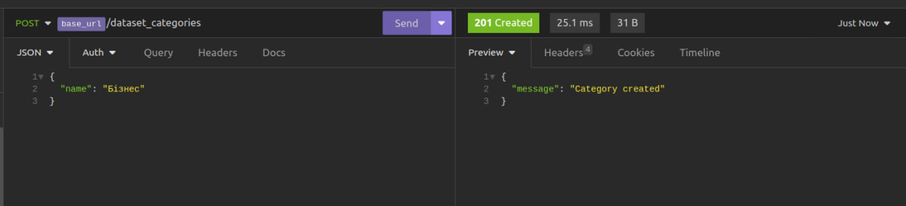

### Update Dataset Category
Введення користувача

    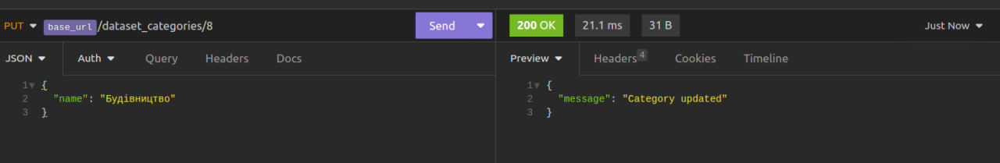

Відповідь сервера

    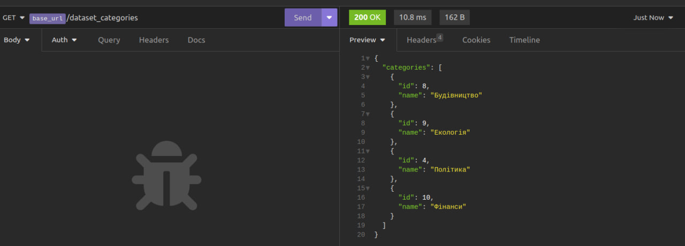

### Delete Dataset Category
Введення користувача

    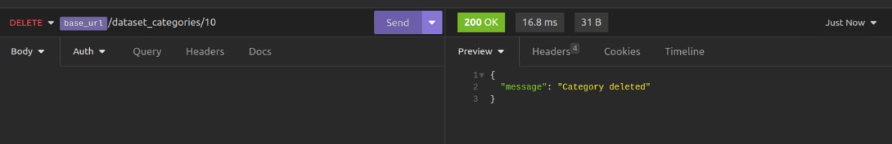

Відповідь сервера

    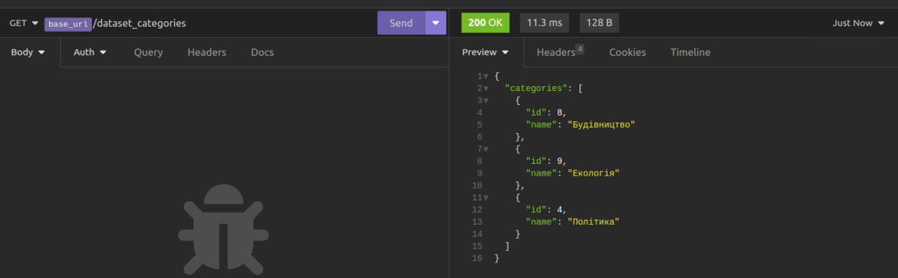

## Dataset

### Get (All)

    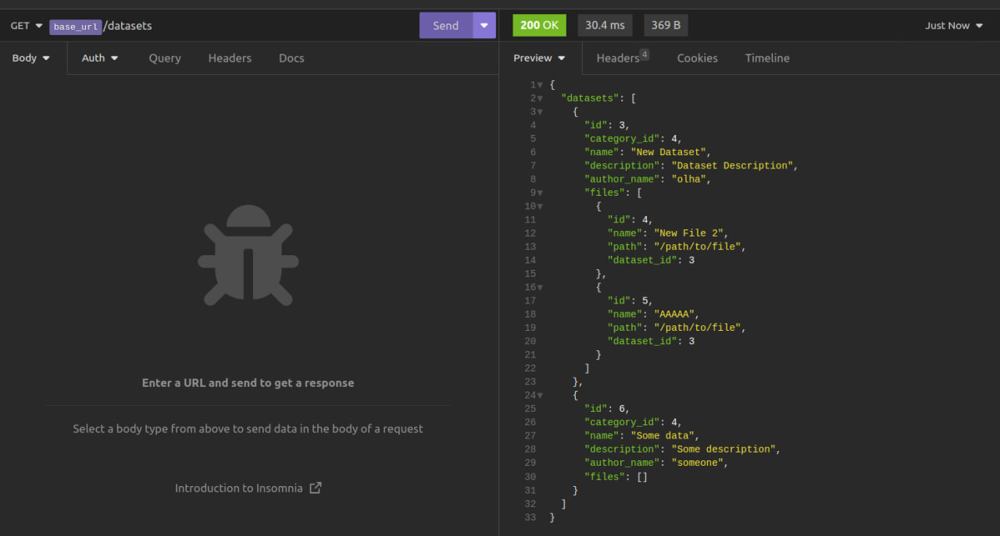

### Create Dataset 

    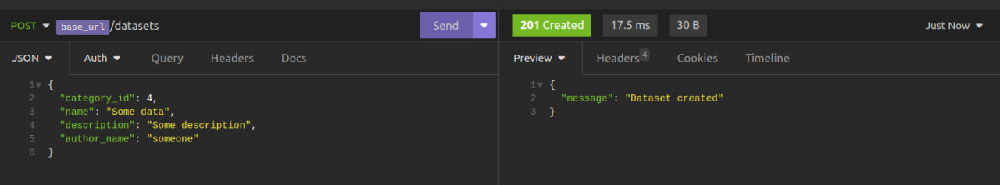

### Update Dataset 

    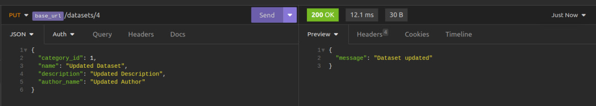

### Delete Dataset
Введення користувача

    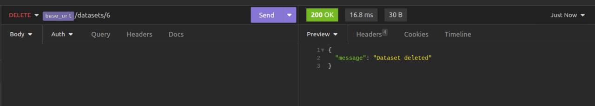

Відповідь сервера

    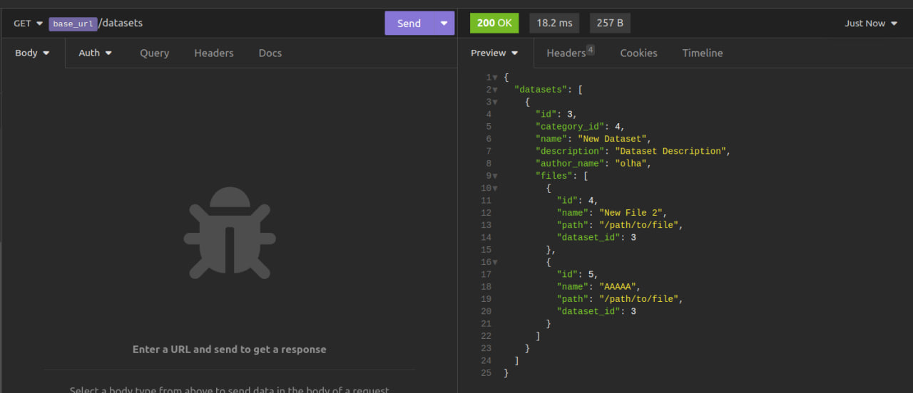

## File

### Get (All)

    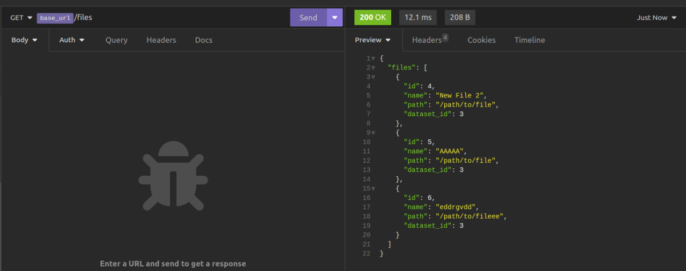

### Get (Single File)

    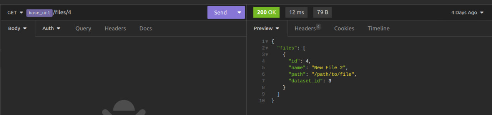

### Create File

    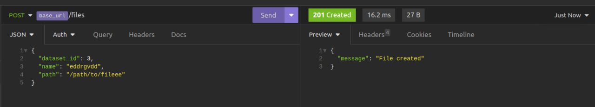

### Update  File
Введення користувача

    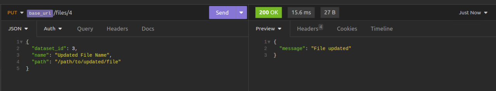

Відповідь сервера

    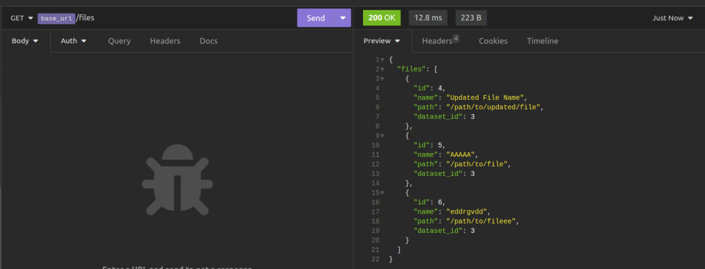

### Delete File
Введення користувача

    

Відповідь сервера

    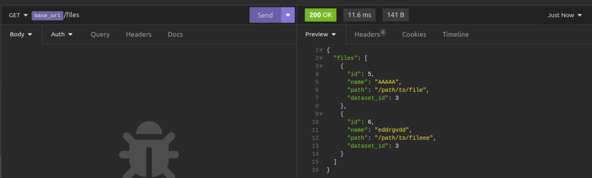

